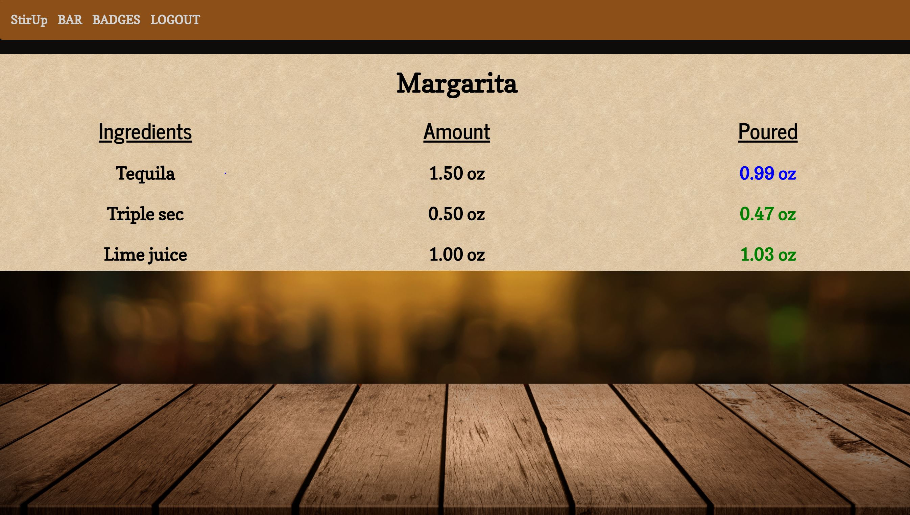
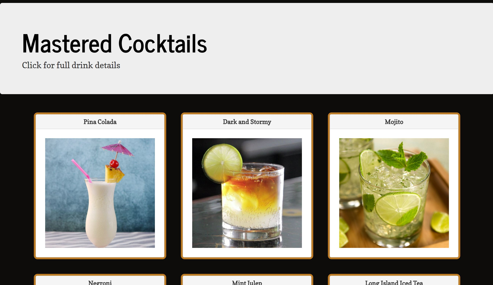

# StirUp
Learn your cocktails with a fun and easy game

## How to play
It's easy! Log in or create a new account, start the game, and try to mix the displayed cocktail as close as possible to the shown recipe.

Use keys 1-4 on the keyboard to pour the respective ingredients. Be careful not to overfill your drink!

Mix a drink 3 times to earn a badge with more details about the drink!

## Try It
This application is [hosted on Heroku](https://bartender-game.herokuapp.com/), so no downloads are necessary to use. Create an account to get started.

## Technologies Used
- [Bootstrap](https://getbootstrap.com/docs/3.3/)
- [React](https://reactjs.org/)
- [React-Bootstrap](https://react-bootstrap.github.io/)
- [NodeJS](https://nodejs.org/en/)
- [Express](https://www.npmjs.com/package/express)
- [MongoDB](https://www.mongodb.com/)
- [Mongoose](http://mongoosejs.com/)
- [mLab MongoDB](https://elements.heroku.com/addons/mongolab)

## Future Ideas
Future enhancements to the site could include:
- A timer to add challenge to the mixing process
- Animation of a pouring cocktail
- Addition of non-liquid and smaller ingredients

## Collaboration
Please see my future ideas. I'm welcome collaboration and suggestions!

## Authors
- [Jim Pratt](https://github.com/ltbackup)

## Acknowledgements
Thanks to TheCocktailDB.com for making this project possible and providing an excellent API.
Also thanks to Lynda Chiwetelu for her excellent tutorial on integrating passport with your application.

